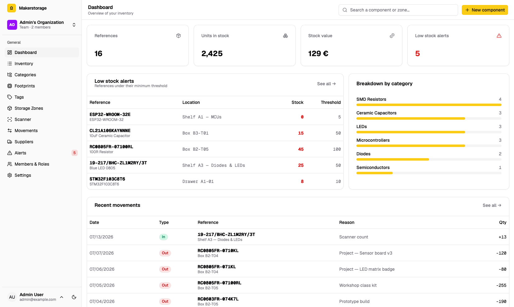

# Makerstorage

[](https://github.com/albanpetit/partstable/actions/workflows/ci.yml)


A multi-tenant inventory manager for makerspaces and fablabs, purpose-built for electronic components. Catalog parts, keep stock accurate down to the drawer, reorder before you run out all scoped per organization.



## Features

- **Inventory** — parts with SKU / MPN / barcode, manufacturer, technical specs, and per-supplier pricing
- **Classification** — organize parts with hierarchical categories, reusable footprints, and free-form tags, each managed from its own page
- **Stock tracking** — quantities per storage location, backed by an append-only stock-movement ledger
- **Storage zones** — a hierarchical location tree (room → cabinet → shelf → bench → drawer → box)
- **Barcode scanner** — look up parts and record stock movements straight from a scan
- **Suppliers & purchasing** — preferred suppliers, pricing, lead times, and generated purchase orders
- **Low-stock alerts** — automatic reorder suggestions from configurable per-part thresholds
- **Dashboard** — at-a-glance stock value, low-stock counts, and category breakdowns
- **Multi-tenant** — every organization has isolated data, its own members with roles (owner / admin / member / viewer), and a configurable internal part-number (IPN) scheme
- **CSV import** — bulk-load parts, auto-creating categories and locations as needed

## Tech stack

| Layer      | Tools                                                              |
| ---------- | ------------------------------------------------------------------ |
| Backend    | Rails 8.1, SQLite, Devise, Inertia Rails, Solid Queue/Cache/Cable  |
| Frontend   | Inertia.js, React 19, TypeScript, Vite, Tailwind CSS v4, shadcn/ui |
| Deployment | Kamal                                                              |

## Getting started

Makerstorage ships as a self-contained Docker image (Rails behind Thruster on port
80, using SQLite and local file storage). You only need a `RAILS_MASTER_KEY` to
boot; configure [SMTP](#email-smtp) as well if you want it to send email.

### Pull the prebuilt image from GHCR

```bash
docker run -d --name makerstorage \
  -p 3000:80 \
  -e RAILS_MASTER_KEY="$RAILS_MASTER_KEY" \
  -v makerstorage-storage:/rails/storage \
  ghcr.io/albanpetit/makerstorage:latest
```

### …or build the image from source

```bash
git clone https://github.com/albanpetit/makerstorage.git
cd makerstorage
docker build -t makerstorage .

docker run -d --name makerstorage \
  -p 3000:80 \
  -e RAILS_MASTER_KEY="$(cat config/master.key)" \
  -v makerstorage-storage:/rails/storage \
  makerstorage
```

The app is then served at `http://localhost:3000`.

- **`RAILS_MASTER_KEY`** decrypts `config/credentials.yml.enc`; it must match the
  credentials baked into the image.
- The **`makerstorage-storage` volume** holds the SQLite databases and uploaded
  files — it persists across restarts and is what you back up.
- The container runs database migrations on boot and serves a health check at
  **`GET /up`**. Map the port however you like and put a TLS-terminating reverse
  proxy in front of it for production, then set **`FORCE_SSL=true`** (see the
  table below).
- Sign-in, password reset, and sign-up are rate-limited **per client IP**. Run the
  proxy on a private network (same host or Docker network) so Rails trusts its
  `X-Forwarded-For` header; otherwise every visitor appears as the proxy's IP and
  shares a single limit.

### Email (SMTP)

Makerstorage sends transactional email (password resets and account-security
notices). Point it at any SMTP provider with the environment variables below.
Without `SMTP_ADDRESS` the app still runs, but password-reset emails aren't
delivered — mail is simply skipped.

| Variable              | Default                                | Description                                                              |
| --------------------- | -------------------------------------- | ------------------------------------------------------------------------ |
| `SMTP_ADDRESS`        | —                                      | SMTP server host. **Setting this enables mail delivery.**                |
| `SMTP_PORT`           | `587`                                  | SMTP port.                                                               |
| `SMTP_USERNAME`       | —                                      | SMTP login. When set, the client authenticates.                         |
| `SMTP_PASSWORD`       | —                                      | SMTP password or API token (**secret**).                                |
| `SMTP_TLS`            | `starttls`                             | `starttls` (port 587), `ssl` (implicit TLS, port 465), or `none`.       |
| `SMTP_AUTHENTICATION` | `plain`                                | `plain`, `login`, or `cram_md5`.                                        |
| `SMTP_DOMAIN`         | —                                      | HELO domain, if your provider requires one.                             |
| `MAILER_SENDER`       | `Makerstorage <no-reply@example.com>`  | `From` address (may include a display name).                            |
| `APP_HOST`            | `localhost`                            | Public hostname used to build links in emails (e.g. `parts.example.org`). |
| `APP_PROTOCOL`        | `https` with `FORCE_SSL`, else `http`  | Protocol of links in emails. Set to `https` when a proxy serves HTTPS without `FORCE_SSL`. |
| `FORCE_SSL`           | —                                      | Set to `true` behind a TLS-terminating proxy: redirects to HTTPS, sends HSTS, and marks the session cookie `Secure`. Leave unset for plain-HTTP LAN installs. |

```bash
docker run -d --name makerstorage \
  -p 3000:80 \
  -e RAILS_MASTER_KEY="$RAILS_MASTER_KEY" \
  -e APP_HOST="parts.example.org" \
  -e MAILER_SENDER="Makerstorage <no-reply@example.org>" \
  -e SMTP_ADDRESS="smtp.example.org" \
  -e SMTP_PORT="587" \
  -e SMTP_USERNAME="no-reply@example.org" \
  -e SMTP_PASSWORD="$SMTP_PASSWORD" \
  -e SMTP_TLS="starttls" \
  -v makerstorage-storage:/rails/storage \
  ghcr.io/albanpetit/makerstorage:latest
```

> **Tip:** to avoid a long `-e` list, put the variables in a file and pass
> `--env-file makerstorage.env`. Keep that file out of version control — it holds
> `SMTP_PASSWORD`.

For deliverability, add **SPF**, **DKIM**, and **DMARC** DNS records for your
sending domain as instructed by your mail provider.

> Setting up a **development** environment instead? See
> [CONTRIBUTING.md](CONTRIBUTING.md#development-setup). To test real delivery
> locally, put the same `SMTP_*` variables in a gitignored `.env`.

## Contributing

Commit conventions, the local check suite, and other contributor guidelines live in [CONTRIBUTING.md](CONTRIBUTING.md).

## License

Licensed under the [GNU Affero General Public License v3.0](LICENSE) (AGPL-3.0). If you run a modified version of Makerstorage as a network service, you must make your modified source available to its users.
